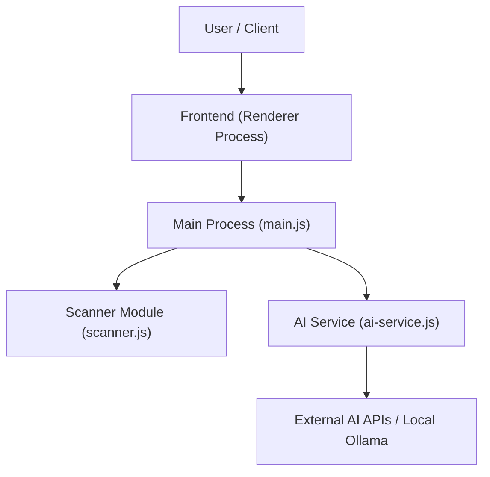

# readme-generator


An intelligent desktop application designed to automate the creation of high-quality project documentation by analyzing your codebase and generating structured README files using AI.

## Description

`readme-generator` is an Electron-based desktop application that bridges the gap between raw source code and professional documentation. By scanning local directories, it analyzes file structures, identifies key technologies (frameworks, languages, dependencies), and generates comprehensive `README.md` content. 

The tool integrates with multiple AI providers—including Google Gemini, Anthropic Claude, OpenAI, and local instances via Ollama—allowing users to generate tailored documentation that accurately reflects their project's architecture and purpose. It features a robust scanning engine capable of handling large projects while providing real-time progress updates and the ability to cancel long operations mid-process.

## Key Features

*   **Deep Project Scanning:** Automatically detects file types, identifies core technologies (React, Vue, Node.js, etc.), and maps out project complexity.
*   **Multi-Provider AI Support:** Seamlessly switch between Gemini, Claude, OpenAI, or local Ollama models to generate content.
*   **Interactive Editor:** A dedicated workspace to review generated sections, provide custom instructions for specific parts of the README, and regenerate individual blocks as needed.
*   **Secure Key Management:** Utilizes Electron's `safeStorage` API to ensure that your AI provider API keys are encrypted on disk.
*   **Export Options:** Export documentation directly to Markdown or high-quality PDF formats with professional styling.
*   **Progress Tracking:** Real-time feedback during the scanning and generation phases, including a detailed list of files being processed.

## Technologies

*   **Framework:** Electron (Desktop Environment)
*   **Frontend Rendering:** HTML5, CSS3, JavaScript
*   **AI Integration:** @google/generative-ai
*   **Markdown Processing:** marked
*   **Diagramming:** mermaid
*   **Package Manager:** npm

## Installation

To set up the project locally, clone the repository and install the necessary dependencies:

```bash
npm install
```

## Usage

1.  Launch the application by running the main entry point:
    ```bash
    node main.js
    ```
2.  **Select Project:** Click on "Select Project" to choose the local directory you wish to analyze.
3.  **Scan & Analyze:** The app will scan your files and provide a summary of detected technologies, file counts, and complexity metrics.
4.  **Configure AI:** Navigate to Settings to input your API keys (the application handles encryption automatically) and select your preferred provider/model.
5.  **Generate:** Click "Generate" to produce the README content based on the scanned data.
6.  **Refine & Export:** Use the editor to tweak specific sections or regenerate them with custom prompts before exporting to `.md` or `.pdf`.

## Folder Structure

*   `main.js`: The primary Electron process entry point handling system-level tasks, IPC communication, and secure storage.
*   `preload.js`: Bridges the gap between the main process and renderer for secure API access.
*   `scanner.js`: Contains logic for traversing directories, filtering files (e.g., .gitignore), and analyzing project metadata.
*   `ai-service.js`: Manages all interactions with various AI providers including prompt construction and response handling.
*   `renderer/`: The frontend directory containing the UI components:
    *   `index.html`: Main application layout.
    *   `renderer.js`: Frontend logic, state management, and DOM manipulation.
    *   `ai.js`: Client-side helper for AI interaction handling.
    *   `styles.css`: Styling for the dashboard, editor, and settings panels.
    *   `assets/`: Contains icons and branding assets.

## Architecture



## License

This project is unlicensed.

