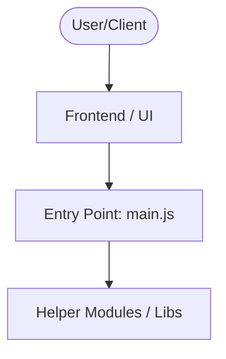

   

A desktop application for generating README.md files using Electron and JavaScript. This tool provides a simple interface to create structured documentation for software projects.

## Description

readme-generator is a lightweight Electron-based application designed to streamline the creation of README.md files. It leverages JavaScript, HTML, and CSS for the frontend, with core logic implemented in the main process. The tool allows users to generate documentation with customizable sections including project description, installation instructions, usage examples, and more.

## Key Features

- **Electron-based UI**: Cross-platform desktop application with native window support
- **Mermaid Diagram Support**: Integrated rendering of architecture diagrams using Mermaid.js
- **Modular Structure**: Separated renderer and main process code for maintainability
- **Minimal Dependencies**: Lightweight with no external runtime dependencies beyond Node.js and Electron
- **Configurable Templates**: Predefined sections for common README components

## Installation Instructions

1. Clone the repository: `git clone https://github.com/yourusername/readme-generator.git`
2. Install dependencies: `npm install`
3. Start the application: `npm start`

The entry point is located in `main.js`, with the renderer process implemented in `renderer/renderer.js`.

## Usage

1. Launch the application through Electron
2. Use the GUI to input project details and select documentation sections
3. Preview generated README content in real-time
4. Export the final README.md file to your file system

The application uses `marked.min.js` for markdown rendering and `mermaid.min.js` for diagram generation.

## Folder Structure

```
readme-generator/
├── main.js                # Entry point for Electron main process
├── renderer/              # Frontend code
│   ├── renderer.js        # Renderer process entry point
│   ├── styles.css         # Application styles
│   └── libs/
│       ├── mermaid.min.js # Diagram rendering library
│       └── marked.min.js  # Markdown parsing library
├── package-lock.json      # Dependency lock file
└── package.json           # Project configuration
```

## Technologies

- JavaScript
- Electron
- HTML
- CSS
- JSON
- Mermaid.js
- marked.js

## Architecture



## Configuration

The application uses `package.json` for project configuration. No additional configuration files are required for basic operation. Advanced customization would require modifying the renderer process code directly.

## Contributing

To contribute:
1. Fork the repository
2. Create a new branch for your changes
3. Make your modifications
4. Submit a pull request

Please ensure all changes follow the existing code structure and style conventions.

## License

This project is unlicensed. You are free to use, modify, and distribute the software without restriction. Please note that this project does not provide any warranty or liability for its use.

